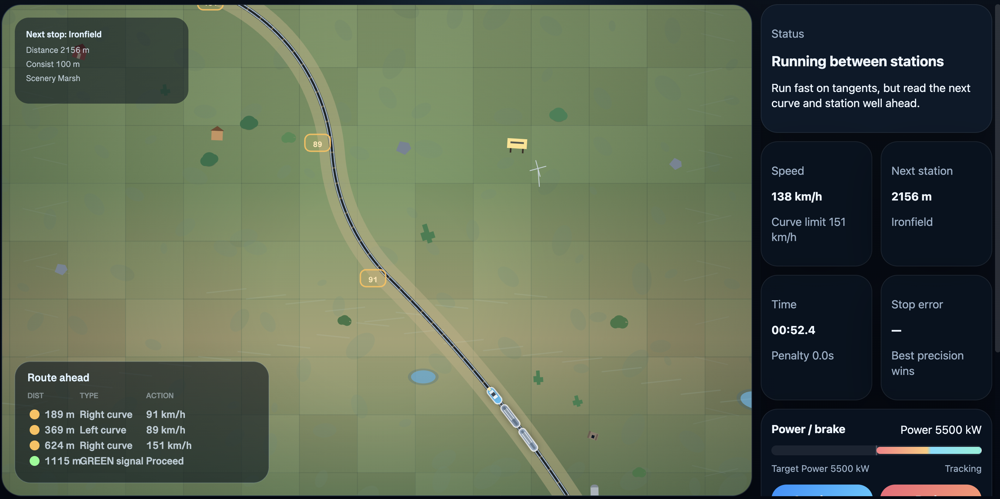

# Train Driver

A static browser-based train driving game built with plain HTML, CSS, and JavaScript and WebGL.

You drive a 100 m consist across a procedurally generated route with stations, signals, curves, speed limits, biome-driven scenery, and derailment penalties for major mistakes.

[Play it on GitHub Pages](https://szakeetm.github.io/trainDriver/)

## Tech Stack

- Plain `index.html`, `styles.css`, and `game.js`
- Vendored `three.min.js` plus `renderer3d.js` for the optional 3D inset view
- No build step, package manager setup, or backend

## Entry Points

- `index.html`: app shell, HUD, canvas, and script loading order
- `game.js`: main game logic, route generation, physics, rendering, input, and audio
- `renderer3d.js`: Three.js-based 3D inset renderer

## Controls

- `W` / `ArrowUp`: increase power
- `S` / `ArrowDown`: increase braking
- On-screen buttons also support pointer/touch input

## Run Locally

Open `index.html` directly in a browser.

There is no install step and no build command.

Gameplay tuning lives in [`game.js`](game.js).

## Testing

There is no automated test suite in this repo.

Testing is currently manual in the browser.
